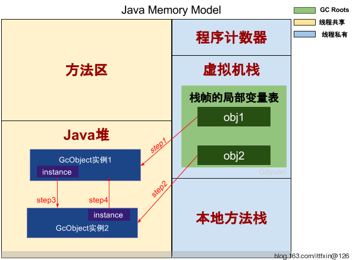
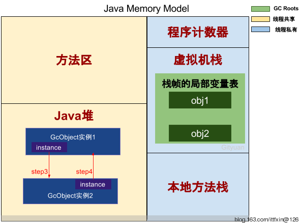
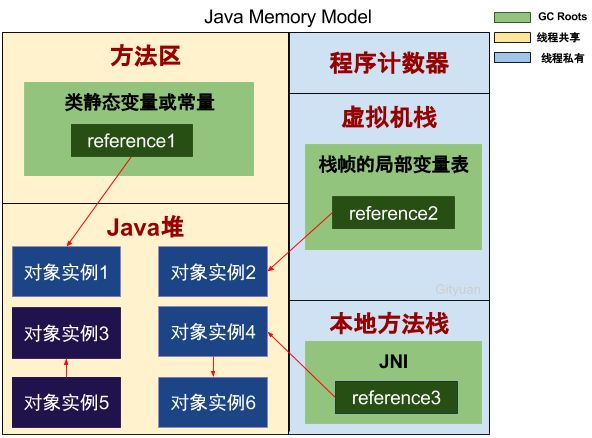

Author: Mike Xie


---


# 研究背景


```java
/**
 *  哪个会跑的更快？
 */
public class PrimitiveVSReferenceType {
    private static final long yiyi = 100000000L; //一亿
    private static final long yiqianwan = 10000000L; //一千万

    public static void main(String[] args) {
        testPrimitiveSum(yiyi);
        testReferenceSum(yiqianwan);
    }

    public static void testPrimitiveSum(long count){
        long startTime = System.currentTimeMillis();

        long sum = 0L;
        for(int i=0; i< count;i++){  //一亿
            sum+=i;
        }

        System.out.println("testPrimitiveSum result: " + sum);
        long endTime = System.currentTimeMillis();
        System.out.println("testPrimitiveSum use time: " + (endTime - startTime));
    }

    public static void testReferenceSum(long count){
        long startTime = System.currentTimeMillis();

        Long sum = 0L;
        for(int i=0; i< count;i++){   //一千万
            sum+=i;
        }

        System.out.println("testReferenceSum result: " + sum);
        long endTime = System.currentTimeMillis();
        System.out.println("testReferenceSum use time: " + (endTime - startTime));
    }
}

```
---

# java 内存模型？
java是在java虚拟机上运行，一般地大家讲到的Java内存其实就是Jvm内存


## 这些数据区分别有什么用？

### 栈区
#### 虚拟机栈

虚拟机栈，生命周期与线程相同，是Java方法执行的内存模型。每个方法(不包含native方法)执行的同时都会创建一个栈帧结构，方法执行过程，对应着虚拟机栈的入栈到出栈的过程。

#### 本地方法栈

本地方法栈（Native Method Stack）与虚拟机栈所发挥的作用是非常相似的，它们之间
的区别不过是虚拟机栈为虚拟机执行Java方法（也就是字节码）服务，而**本地方法栈则为虚拟机使用到的Native方法服务**

#### 程序计数器

程序计数器（Program Counter Register）是一块较小的内存空间，它可以看作是当前线
程所执行的字节码的行号指示器。 在虚拟机的概念模型里（仅是概念模型，各种虚拟机可能
会通过一些更高效的方式去实现），字节码解释器工作时就是通过改变这个计数器的值来选
取下一条需要执行的字节码指令，分支、 循环、 跳转、 异常处理、 线程恢复等基础功能都需
要依赖这个计数器来完成。

### 堆区

对于大多数应用来说，Java堆（Java Heap）是Java虚拟机所管理的内存中最大的一块。

Java堆是被**所有线程共享**的一块内存区域，在虚拟机启动时创建。

**此内存区域的唯一目的就是存放对象实例，几乎所有的对象实例都在这里分配内**存

### 方法区

1. 方法区（Method Area）与Java堆一样，是**各个线程共享**的内存区域
2. 它用于存储已被虚拟机加载的类信息、 常量、 静态变量、 即时编译器编译后的代码等数据。
3. 虽然Java虚拟机规范把方法区描述为堆的一个逻辑部分，但是它却有一个别名叫做Non-Heap（非堆），目的应
该是与Java堆区分开来
4. 对于习惯在HotSpot虚拟机上开发、 部署程序的开发者来说，很多人都更愿意把方法区
称为 **“永久代”（Permanent Generation）**，本质上两者并不等价，仅仅是因为HotSpot虚拟机的
设计团队选择把GC分代收集扩展至方法区，或者说 **使用永久代来实现方法区而已**，**这样
HotSpot的垃圾收集器可以像管理Java堆一样管理这部分内存，能够省去专门为方法区编写内
存管理代码的工作**

# GC 需要考虑的问题

## 哪些内存需要回收？
1. 线程独占区不存在垃圾回收问题：虚拟机栈、本地方法栈、程序计数器
2. **线程共享区存在垃圾回收问题： 堆区、 方法区**
3. 垃圾回收的重点区域是 Java堆区，其次是方法区
4. 要回收已经死了的对象，而不是活的

### 如何判断对象是否已死？


#### 引用计数法（Redis）

##### 原理
1. 每个对象有一个引用计数器，当对象被引用一次则计数器加1，当对象引用失效一次则计数器减1，对于计数器为0的对象意味着是垃圾对象，可以被GC回收

2. 采用引用计数算法的系统只需在每个**实例对象创建之初**，通过计数器来记录所有的引用次数即可

##### 例子

```java
 public class GcDemo {

    public static void main(String[] args) {
        //分为6个步骤
        GcObject obj1 = new GcObject(); //Step 1
        GcObject obj2 = new GcObject(); //Step 2

        obj1.instance = obj2; //Step 3
        obj2.instance = obj1; //Step 4

        obj1 = null; //Step 5            = null, 去除对象引用的一种方式
        obj2 = null; //Step 6
    }
}

class GcObject{
    public Object instance = null;
}
```

##### 分析
java内存模型



再回到前面代码GcDemo的main方法共分为6个步骤

1. Step1：GcObject实例1的引用计数加1，实例1的引用计数=1；
2. Step2：GcObject实例2的引用计数加1，实例2的引用计数=1；
3. Step3：GcObject实例2的引用计数再加1，实例2的引用计数=2；
4. Step4：GcObject实例1的引用计数再加1，实例1的引用计数=2；

执行到Step 4，则GcObject实例1和实例2的引用计数都等于2。

接下来继续结果图：



5. Step5：栈帧中obj1不再指向Java堆，GcObject实例1的引用计数减1，结果为1；
6. Step6：栈帧中obj2不再指向Java堆，GcObject实例2的引用计数减1，结果为1。


**到此，发现GcObject实例1和实例2的计数引用都不为0，那么如果采用的引用计数算法的话，那么这两个实例所占的内存将得不到释放，这便产生了内存泄露**。


> 存在即合理，并不能因为引用计数法不能解决对象循环应用的问题而说的引用计数法一无是处。


---


#### 可达性分析法
- GC roots
- 可达性
- 基于图的深度遍历算法

##### 依据
1. 对任何“活”的对象，一定能最终追溯到其存活在堆栈或静态存储区中的引用
2. 这个引用链条可能会穿过数个对象层次（引用传递）
3. 由此，如果从堆栈（**这里指代的是运行时数据区中的栈区**）或静态存储区开始，遍历所有的引用，就能找到所有的“活”的对象。
4. 对于发现每个引用，必须追踪它所引用的对象，然后是此对象包含的所有的引用 
5. 如此反复进行，直到“根源于堆栈和静态存储区的引用”所形成的网络全部被访问为止。你所访问的对象都是“活”的。
6. 这个思想可以解决了“交互自引用的对象组”的问题
7. ==GC 的时候才会考虑到这些问题==

##### GC ROOTS
> **Roots tell the garbage collector where to start tracing**. The garbage collector determines which blocks are **reachable** from the roots, and (in automatically managed pools) reclaims the **unreachable** blocks. This is quite efficient and can be a very good approximation to liveness.

> It is therefore important that all references that the client program can **directly access are registered as roots**, otherwise the garbage collector might recycle an object that would be used in the future.

##### 可作为GC roots的对象有
- 虚拟机栈中的引用对象
- 方法区中类静态属性引用的对象
- 方法区中常量引用对象
- 本地方法栈中JNI（即一般所说的Native方法）引用对象 

##### 代码
```
 public class GcDemo {

    public static void main(String[] args) {
        //分为6个步骤
        GcObject obj1 = new GcObject(); //Step 1
        GcObject obj2 = new GcObject(); //Step 2

        obj1.instance = obj2; //Step 3
        obj2.instance = obj1; //Step 4

        obj1 = null; //Step 5
        obj2 = null; //Step 6
    }
}

class GcObject{
    public Object instance = null;
}
```
##### 分析


从上图，**reference1、reference2、reference3都是GC Roots**，可以看出：
1. reference1-> 对象实例1；
2. reference2-> 对象实例2；
3. reference3-> 对象实例4；
4. reference3-> 对象实例4 -> 对象实例6；
5. 可以得出对象实例1、2、4、6都具有GC Roots可达性，也就是存活对象，不能被GC回收的对象。
而对于对象实例3、5直接虽然连通，但并没有任何一个GC Roots与之相连，这便是GC Roots不可达的对象，这就是GC需要回收的垃圾对象。

#### 结论
 到这里，相信大家应该能彻底明白引用计数算法和可达性算法的 **区别** 吧。
再回过头来看看最前面的实例，GcObject实例1和实例2虽然从引用计数虽然都不为0，但从可达性算法来看，都是GC Roots不可达的对象。
总之，对于对象之间循环引用的情况，引用计数算法，则GC无法回收这两个对象，而可达性算法则可以正确回收。


